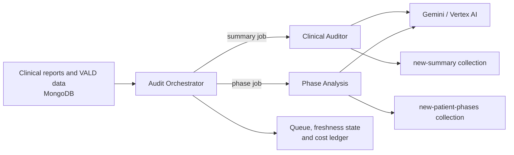

# Clinical Audit & Rehabilitation Intelligence Platform

## What this project does

This platform turns a patient's clinical notes and VALD performance data into two clinician-facing outputs:

1. **Clinical summary** — a structured rehabilitation assessment, risks, treatment gaps, and concise summary.
2. **Phase intelligence** — a timeline of rehabilitation phases, phase changes, missing information, and protocol alerts.

It uses MongoDB as the clinical-data source, Google Vertex AI / Gemini for analysis, and MongoDB again to store the generated outputs. An orchestrator can automatically react to new clinical data or accept a manual request from the UI/API.

## Main flow



### What happens for one patient

1. A report or VALD record changes, or a user requests generation manually.
2. The **orchestrator** creates or updates one queue record for that patient.
3. It checks whether the summary and phase outputs are already current for the latest input revision.
4. It sends an authenticated, idempotent job request to the required service.
5. The **Clinical Auditor** builds a clinical timeline and generates the summary.
6. The **Phase Analysis** service builds the same patient timeline and generates rehabilitation phases.
7. Each service stores its output with an upsert, so a patient has one current document per output type.
8. Durable jobs expose `pending`, `running`, `completed`, `failed`, or `cancelled` status. The orchestrator records completion and estimated execution cost.

## Main components and files

| Area | Main file(s) | Responsibility |
|---|---|---|
| Local/dev deployment | `docker-compose.dev.yml` | Starts the three isolated dev services on ports 5011–5013 and writes only to dev output collections. |
| Production deployment | `docker-compose.yml`, `docker-compose.prod.yml`, `deploy.sh` | Defines the production service topology and deployment workflow. |
| Orchestrator entry point | `orchestrator/main.py` | Starts the API and, when enabled, the database watcher and scheduler. |
| Orchestrator API | `orchestrator/api.py` | Health, queue, cost report, manual trigger, and force-dispatch endpoints. |
| Change detection | `orchestrator/watcher.py` | Watches report and VALD changes, filters qualifying updates, and adds queue work. |
| Dispatch and freshness | `orchestrator/scheduler.py`, `orchestrator/freshness.py`, `orchestrator/completion.py` | Decides what is stale, dispatches work, waits for completion, and records the result. |
| Queue state | `orchestrator/queue.py` | Deduplicates edits, stores queue revisions, handles retries, and tracks per-pipeline completion. |
| Summary service API | `api/summary_api.py` | Accepts summary jobs, reports job status, and runs the clinical audit in the worker. |
| Phase service API | `api/phase_analysis_ws.py` | Accepts phase jobs, reports status, and runs phase analysis in the worker. |
| Durable job engine | `api/job_store.py` | Idempotency, leases, cancellation, retries, execution ledger, request deadlines, and safe persistence fencing. |
| Clinical AI workflow | `LLM/report-gen/run_audit_by_stance_id.py`, `LLM/report-gen/eba_agent.py`, `LLM/report-gen/concise_agent.py` | Loads clinical data, creates the Gemini assessment, then produces the concise output. |
| Phase AI workflow | `LLM/phase-analysis/phase_intelligence_engine.py` | Creates the phase-based rehabilitation analysis from the patient timeline. |
| Output persistence | `LLM/report-gen/push_report_to_mongo.py`, `LLM/phase-analysis/push_phases_to_mongo.py` | Validates and upserts generated output documents into MongoDB. |
| Configuration | `.env.dev`, `.env.prod.example` | Provides environment-specific connection, credential-path, authentication, and tuning values. Never commit real secrets. |

## Reliability and safety built into the flow

- Internal API calls require `API_AUTH_TOKEN`.
- Duplicate requests use idempotency keys, so one request does not create duplicate work.
- Jobs survive process restarts through MongoDB-backed job records and leases.
- A cancelled or expired job cannot write a late output.
- Each Gemini request has a timeout and fallback models; the full job also has a deadline.
- Summary and phase outputs are stored separately and updated with upserts.
- The cost ledger stores execution metadata without copying patient payloads.
- Development uses separate output collections and has automatic scheduling disabled by default.

## Implemented improvements

- Moved runtime credentials and deployment settings into environment configuration; removed static credential references from active deployment configuration.
- Added authenticated internal API calls between the orchestrator and generation services.
- Added durable MongoDB-backed jobs with idempotency keys, leases, retries, cancellation, and restart recovery.
- Added separate completion and freshness tracking for summary and phase outputs.
- Prevented duplicate input-change events and duplicate patient dispatches.
- Added summary and phase output upserts so each patient keeps one current output document per type.
- Added an execution ledger and daily cost reporting for generation runs.
- Reduced duplicate AI input and improved handling of hierarchical VALD timeline data.
- Added validation for phase-report parsing and generated output structures.
- Added Gemini request deadlines, full-job deadlines, retryable fallback models, including provider cancellation recovery.
- Added a complete isolated dev stack with the orchestrator, manual-only scheduling, and dev-only output collections.

## Five-minute demo

1. Show the running containers:

   ```bash
   docker compose -f docker-compose.dev.yml ps
   ```

2. Explain the three services:
   - `clinical-auditor-dev`: creates the clinical summary.
   - `phase-analysis-dev`: creates rehabilitation phases.
   - `audit-orchestrator-dev`: coordinates jobs and tracks freshness.

3. Submit one manual summary or phase request through the local API using a test patient.
4. Show real-time progress:

   ```bash
   docker compose -f docker-compose.dev.yml logs -f clinical-auditor-dev phase-analysis-dev
   ```

5. Show that the output was written to `new-summary-dev` or `new-patient-phases-dev` and that the job status is `completed`.

## Suggested 20-minute client explanation

| Time | Topic | Key message |
|---:|---|---|
| 0–3 min | Goal | Converts fragmented clinical and performance data into a usable rehabilitation review. |
| 3–7 min | Architecture | Three focused services: coordinator, summary generator, and phase generator. |
| 7–12 min | Patient flow | A single patient request creates durable jobs and produces two separate outputs. |
| 12–16 min | Reliability | Freshness checks, idempotency, retries, timeouts, cancellation, and persistent status reduce duplicate or lost work. |
| 16–20 min | Live demo | Trigger a test job, show logs/status, and open the generated dev output. |

## Useful operational commands

```bash
# Container status
docker compose -f docker-compose.dev.yml ps

# Follow all service logs
docker compose -f docker-compose.dev.yml logs -f

# Start or rebuild the dev stack
docker compose -f docker-compose.dev.yml up -d --build

# Stop the dev stack
docker compose -f docker-compose.dev.yml down
```

## Important distinction: development vs production

The dev stack is intended for safe validation. It uses separate ports, containers, queue data, and output collections. Production configuration must use the production Compose files and a production environment file with credentials supplied outside Git.
